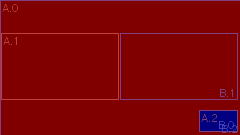

# Vocotomix Transitions

## Purpose

The purpose of _voctomix_ __transitions__ is to implement an easy way to semi-automatize fading from one _video mixing scenario_ to another. We call those scenarios __composites__. A composite in _voctomix_ traditionally consitsts of up to two mixed video sources __A__ and __B__ whose representation parameters we call __frames__.

So far _voctomix_ was capable of using the following preset composites:

- single source __*s*(A)__
  - single  source full screen
- two sources __*t*(A,B)__
  - side-by-side
  - picture-in-picture
  - side-by-side-preview

Until transitions existed in _voctomix_, switching between any of these compositing scenarios was made rapidly from one frame to the next. The idea of transitions is to fade between composites by doing an animation and/or alpha (transparency) blending. With _voctomix_ __transitions__ we like to produce the most expected result for every possible scenario and give the user also the ability to create new composites and adjust or improve existing ones or even invent new transitions.

Generally we can differ between the following transition cases.
The images below show in source <span style="color:red">__A__</span> in red and source <span style="color:blue">__B__</span> in blue.
__s(A)__ and __t(A,B)__ are composites showing one or two sources.

#### *s*(A) &harr; *s*(B)


First case is to switch from one full screen source to another by switching A &harr; B. The most common method here is to blend transparency of both sources from one to the other.

#### *s*(A) &harr; *t*(A,B)


Switch from full screen to a composite of both sources can be done by blending the alpha channel of the added source from transparent to opaque or by an animation of the incoming source or both.

#### *t*(A,B) &harr; *t*(B,A)


To switch between A and B within a composite an animation is preferable. In some composites like __PiP(A,B)__ the second source (B) is overlapping the first one (A) and so the *z-order* (order in which the frames have to be drawn) has to be flipped within a transition to get a proper effect.

To guarantee that this is possible transitions can be improved by inserting so-called __intermediate composites__ which add __key frames__ for both sources. _voctomix_ __transitions__ is then using *B-Splines* to interpolate a smooth motion between __*t*(A,B)__ &harr; __*t'*(A,B)__ &harr; __*t*(B,A)__. You even can use multiple intermediate composites within the same transition, if you like.

#### *t<sub>1</sub>*(A,B) &harr; *t<sub>2</sub>*(A,B)


Switching the composite while leaving the sources A and B untouched is similar to the previous case __*t*(A,B)__ &harr; __*t*(B,A)__ except that there is usually no need to have intermediate composites to switch the z-order because A and B remain unswapped.

#### *s*(__A<sub>1</sub>__) &harr; *s*(__A<sub>2</sub>__), *t*(A<sub>1</sub>,B) &harr; *t*(A<sub>2</sub>,B) or *t*(A,B<sub>1</sub>) &harr; *t*(A,B<sub>2</sub>)

Switching one of both sources to another input channel can lead to a three sources scenario which is currently not covered by _voctomix_ __transitions__ but shall be part of *future development*.

## Entities

To use the following code you first need to import some stuff.

```python
from transitions import Transitions, Composites, L, T, R, B, X, Y
```

`L`, `T`, `R` and `B` are not mandatory but may be helpful when accessing the coordinates of the resulting animation frames.
`X` and `Y` can be used to access width amd height in `size`.


### Composites

`Composites` (plural) is a python class of the preferred interface to _voctomix_ __composites__ and includes the following function:

#### Composites.configure()
Reads a configuration and returns all included composites.
Take that return value and give it to `Transitions.configure()` to load the transitions configuration.
You may also use the included composites to set up your compositor's switching capabilities - for example in the user interface.
```python
def configure(cfg, size):
```
Additionally you have to give `size` which must be a list including _width_ and _height_ in pixels of both source frames.
It is an external parameter and should be given by your compositor configuration.
`size` will be used to calculate coordinates from any proportional floating point values inside the configuration and for calculating source related coordinates of any cropping.

The return value is a dictonary of `string` &harr; `Composite`.

In *future development* this could also take different `size` values for each source too.

#### Equivalent Composites

A word about the equality of composites in the meaning of there appearance:

A frame of size `[0,0]` is invisible like one with an alpha value of `0`.
Also a composite of two frames where one is overlapping the other completely includes one invisible frame.
So these composites may be treated as equivalent when using `Transition.find()` if one frame differs in both composites by some properties but is overall invisible in both.

This is why `Transition.find()` (see below) is quite intuitive in finding matching transitions.

### Transitions

`Transitions` (plural) is a python class of the preferred interface to _voctomix_ __transitions__ consisting of the following functions.

#### Transitions.configure()
Reads a configuration and returns all included transitions.
Take that return value and give it to `find()` to fetch a specific transition.
```python
def configure(cfg, composites, fps=25):
```
Generates all transitions configured by the list of named configuration values in dictonary `cfg` (`string` &rarr; `string`) by using the given `composites` and `fps` (frames per second) and return them in a dictonary of `string` &rarr; `Transition`.

#### Transitions.find()
Fetch a transition whose beginning and ending is matching the given composites.
```python
def find(begin, _end, transitions):
```
Searches in the given `transitions` for a transition that fades `begin` to `_end`.
In a second step also generates reversed versions of transitions that matches that way.

In *future development* this could easily return all matching transitions to add a randomizer or so.

#### Transitions.travel()
Returns a list of pairs of composites along all possible transitions between all given `composites` by walking the tree of all combinations recusively.
```python
def travel(composites, previous=None):
```
Parameter `previous` shall always be the default `None` and must only be used internally for recursion.
This method is just a tool to walk all possible transitions in one animation and so concatinate existing transitions.

Currently it is only used within the _Transition Tester_ to generate test output but could be also subject of *future development* to generate more complex animations by concatination.


### Transition

A transition consists of a list of composites.
These composites can be two or more in a list of __key composites__ to generate an animation for or a list of composites which describe an already generated animation and so a ready-to-go transition.

#### Transition.frames()
Returns the number of composites stored in this transition.
```python
def frames(self):
```
The return value can be either the _number of key frames_ or the _number frames of an animation_ depending on if this transition instance is meant to be used as a parameter to calculate an animation or as return value of that calculation.

#### Transition.A/B()
Returns one frame of the sources A or B which shall be realized within your compositor.
```python
def A(self, n):
def B(self, n):
```
Precisely returns `Frame` number `n` of source A or B of the `Transtition`.

#### Transition.flip()
Return the number of preferred frame to flip both sources (and the scenario) to get a propper z-order behavior.
```python
def flip(self):
```
Using this information is stronlgy recommended to get smooth results, when using transitions of type *t*(A,B) &harr; *t*(B,A).


### Composite

A `Composite` instance includes two frames for source A and B and includes no functions you need to know about to use _voctomix_ __transitions__.

### Frame

A __Frame__ includes all the information necessary to set up a single source in your compositor:

#### Frame.rect
Returns the dimensions in pixels of this frame.
```python
self.rect = [0, 0, 0, 0]
```
The value is a list of coordinates of the _left_, _top_, _right_ and _bottom_ of the frame.
Use imported constants `L`, `T`, `R` and `B` to access these list elements.
The default is an empty rect in the upper-left corner.

#### Frame.alpha
The transparency value of this frame.
```python
self.alpha = 255
```
A value between `0` and `255` where `0` means invisible, `255` means opaque and values between describe the corresponding semi-transparency.


#### Frame.crop
The source's cropping values which may change within a transition animation.
```python
self.crop = [0, 0, 0, 0]
```
The values are the _left_, _top_, _right_ and _bottom_ cropping meant as distance from the frame's originally borders.
Because cropping is a property of the video source these values will be related to the source size given to `Composites.configure()`.  

#### Frame.key
This member is `True` if this is a key frame loaded from the configuration or `False` if it was generated by interpolation.
```python
self.key = key
```

#### Frame.cropped()
Returns the cropped rectangle of the frame related to the current size of the frame.
```python
def cropped(self):
```
Use this to get the resulting frame's extent which will be visible in the image mixed by your compositor.


## Configuration

Configuration is done with an INI file like all the other voctomix configuration.

Additionally we like to leave the configuration as easy and compatible as possible to former configurations.
Because we also like to increase the flexibility, any unification of the composites does indeed lead to a quite different configuration format.
To keep migration easy the basic options and values are mostly just reordered or renamed.  

### Configure Composites

List of configurations of custom named composites for mixing video sources A and B.

Attribute|Format (see below)|Default (when absent)
-|-|-
_name_`.a`|RECT|no output (like `*` or `0/0 0x0`)
_name_`.b`|RECT|no output
_name_`.crop-a`|CROP|no cropping (like `0` or `0/0/0/0`)
_name_`.crop-b`|CROP|no cropping
_name_`.alpha-a`|ALPHA|opaque (like `255` or `1.0`)
_name_`.alpha-b`|ALPHA|opaque
_name_`.inter`|BOOL|not intermediate

#### _name_
All attributes begin with the composite name followed by a dot `.` and the attribute's name.
A composite can be freely named but _name_ must be unique.

#### RECT
Rectangular coordinates are given in diffrent formats like: `X/Y WxH`, `POS WxH`, `X/Y SIZE`, `POS SIZE` or `*`.

Whereat `X`,`Y`,`W`,`H` can be mixed integer pixel coordinates or float proportions.
`POS` and `SIZE` need to be float proportions.
`*` stands for full screen and inserts the `size` which was once given to `Composites.configure()`.

##### Examples
```ini
c.a = 10/10 100x100          ; source A pixel dimensions with format 'X/Y WxH'
```
```ini
c.a = 0.4 0.2                ; source A float proportions with format 'XY WH'
```
```ini
c.a = 0.1/10 0.9             ; stupid mixup with format 'X/Y WH'
c.b = *                      ; source B becomes full screen
```

#### CROP
Cropping borders which are given by either `L/T/R/B`, `LR/TB` or `LRTB`

`L`,`T`,`R`,`B`, `LR`,`TB` and `LRTB` can be mixed integer absolute coordinates or float
proportions.

##### Examples
```ini
c.crop-a = 0/100/0/100       ; source A pixel cropping borders with format 'L/T/R/B'
```
```ini
c.crop-a = 0.0/0.2           ; source A float proportional borders with format 'LR TB'
```
```ini
c.crop-b = 0.1               ; source B 10% from each border in format 'LRTB'
```

#### ALPHA

Integer value in the range between `0` (invisible) and `255` (opaque) or float value between `0.0` (invisible) and `1.0` or `*` (both opaque)

##### Examples
```ini
c.alpha-a = 0.5               ; 50% semitransparent source A as float
c.alpha-b = *                 ; opaque source B using '*'
```

#### BOOL

Some value. If non-empty the option will be set ('true' for example)

##### Examples
```ini
c.inter = yes                 ; make 'c' an intermediate composite
```

#### Absolute and Proportional Coordinates

In __RECT__, __ALPHA__ and __CROP__ you may decide if you like use _absolute pixel coordinates_ or _proportional floating point values_.
Using proportional values is often an advantage because you can easily change the full screen size once and all other pixel values will be automatically calculated with that size.
This enables you to use the same composites configuration with different resolutions but similar apect ratio.

### Configure Transitions

The configuration of a transition is more easy.
List all transitions in an ini section like `[transitions]`.
Each one can be freely named and describes a timespan and a list of composites which will be processed into an animation. Interpolation will be linear with two composites and B-Splines for more.

```ini
my_transition = 1000, pip / sidebyside
```
This generates a linear transition from composite `pip` to composite `sidebyside` lasting one second (`1000` milliseconds).
```ini
my_transition = 1500, pip / sidebyside / pip
```
This generates a B-Spline transition from composite `pip` to composite `sidebyside` to composite `pip` (with A and B automatically swapped) with a duration of one and a half seconds (`1500` milliseconds).

## Using Transitions in Code

```python
from transitions import Composites, Transitions, L, T, R, B
from configparser import SafeConfigParser
from out_of_scope import update_my_compositor

# set frame size
size = [1920, 1080]
# set frames per second
fps = 25
# load INI files
config = SafeConfigParser()
config.read(filename)
# read composites config section
composites = Composites.configure(config.items('composites'), size)
# read transitions config section
transitions = Transitions.configure(config.items('transitions'), composites, fps)

# search for a transitions that does a fade between fullscreen and sidebyside composites
t_name, t = Transitions.find(composites["fullscreen"], composites["sidebyside"], transitions)
# stupid loop through all frames of the animation
for i in range(t.frames()):
  # access current frame in animation to update compositing scenario
  update_my_compositor( t.A(i), t.B(i) )
```

## Transition Tester

The transitions tester lists information about what composites and transitions are definded in a configuration called `composite.ini` and generates PNG files or animated GIF for each listed transition.
You may also select additional drawing of cropping, key frames or a title by command line option or take a further look into the calulations by using verbose mode.

```raw
▶ python3 testtransition.py -h  
usage: testtransition.py [-h] [-l] [-g] [-t] [-k] [-c] [-C] [-r] [-n] [-P]
                         [-L] [-G] [-v]
                         [composite [composite ...]]

transition - tool to generate voctomix transition animations for testing

positional arguments:
  composite       list of composites to generate transitions between (use all
                  available if not given)

optional arguments:
  -h, --help      show this help message and exit
  -l, --list      list available composites
  -g, --generate  generate animation
  -t, --title     draw composite names and frame count
  -k, --keys      draw key frames
  -c, --corners   draw calculated interpolation corners
  -C, --cross     draw image cross through center
  -r, --crop      draw image cropping border
  -n, --number    when using -g: use consecutively numbers as file names
  -P, --nopng     when using -g: do not write PNG files (forces -G)
  -L, --leave     when using -g: do not delete temporary PNG files
  -G, --nogif     when using -g: do not generate animated GIFS
  -v, --verbose   also print WARNING (-v), INFO (-vv) and DEBUG (-vvv)
                  messages
```

### Example Usage

```
▶ python3 testtransition.py -lvgCctk pip
1 targetable composites:
	pip
7 intermediate composites:
	fullscreen-pip
saving transition animation file 'pip-pip.gif' (pip-pip, 37 frames)...
1 transitions available:
	pip-pip
```

This call generated the following animated GIF:



Using the following configuration file:

```ini
[output]
size    = 960x540
fps     = 25

[composites]
pip.a                               = *                 ; full screen
pip.b                               = 0.83/0.82 0.16    ; lower-right corner with 16% size

sidebyside.a                        = 0.008/0.25 0.49   ; left-middle nearly half size
sidebyside.b                        = 0.503/0.25 0.49   ; right-middle nearly half size

[transitions]
; transition from pip to pip (swapped) over sidebyside within 1.5 seconds
pip-pip                             = 1500, pip / sidebyside / pip
```

### Code

#### main program
The main program consists of several functions which are called from a main block:

```python
read_arguments()
init_log()
render_sequence(*read_config("composite.ini"))
```
`render_sequence()` takes exactly what `read_config()` is delivering.

#### read_arguments()
Reads command line arguments like described above.
```python
def read_arguments():
```
Fills global `Args` with the parser result.

#### init_log()
Initializes debug logging.
```python
def init_log():
```
Global `log` gets the logger instance.

#### read_config()
Read from the given file.
```python
def read_config(filename):
```
`filename` is the name of the config file.

#### render_sequence()
Render all transitions between all items in the given sequence.
```python
def render_sequence(size, fps, targets, transitions, composites):
```
Sequence is defined by the names listed in `targets`.
Producing images of the given `size`.
Calculate with `fps` frames per second and use the `transitions` and `composites` dictonaries to find matching transitions.

#### draw_transition()
Internal function that draws one transition and returns a list of images.
```python
def draw_transition(size, transition, name=None):
```
Producing images of `transtion` in the given `size`.

#### save_transition_gif()
Generates an anmiated GIF of the given name of an animation.  
```python
def save_transition_gif(filename, size, name, animation, time):
```
`filename` is the name of the resulting file, `size` it's dimensions, `name` the displayed title, `animation` the transition to render and `time` the duration of that whole animation in the GIF.

## Integration into exisiting voctomix

To get out video transition effect within _voctomix_ the configuration needs a format update and the compositor must be extended by the ability to switch the compositing scenario quickly frame by frame synchronized with the play time.

## Future Development

- May be have just one `configure()` in `Transitions` which returns both composites and transitions so that you only need to import the Transitions interface instead of additionally the Composties interface.
- Decide in which way three source scenarios like *t*(A<sub>1</sub>,B) &harr; *t*(A<sub>2</sub>,B) or *t*(A,B<sub>1</sub>) &harr; *t*(A,B<sub>2</sub>) can profite from any kind of specialized transitions.
- What about unlimited sources?
